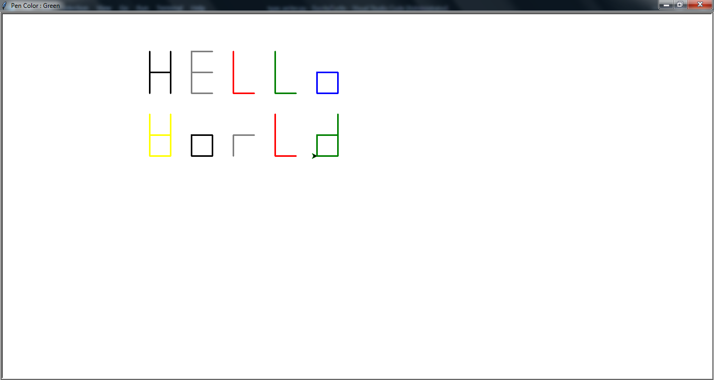
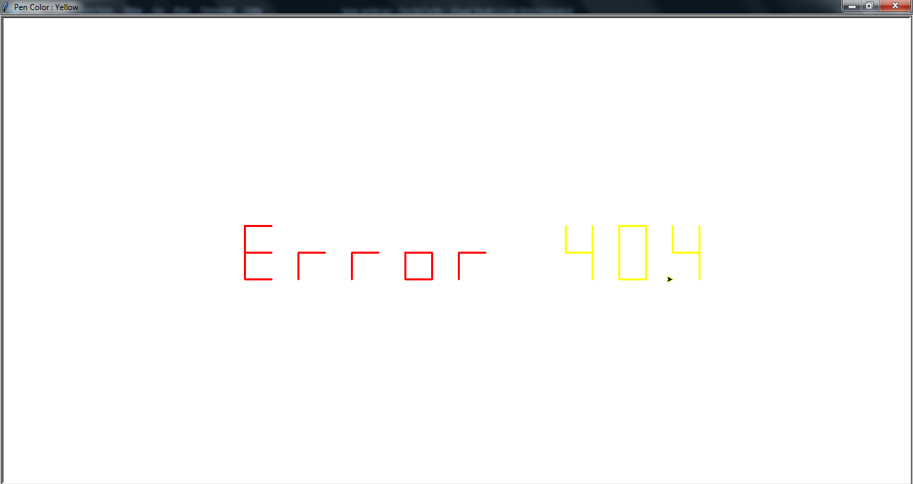
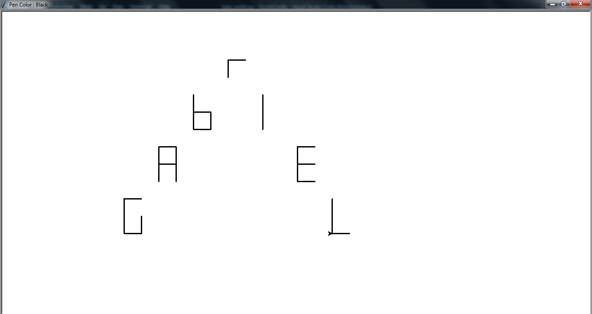
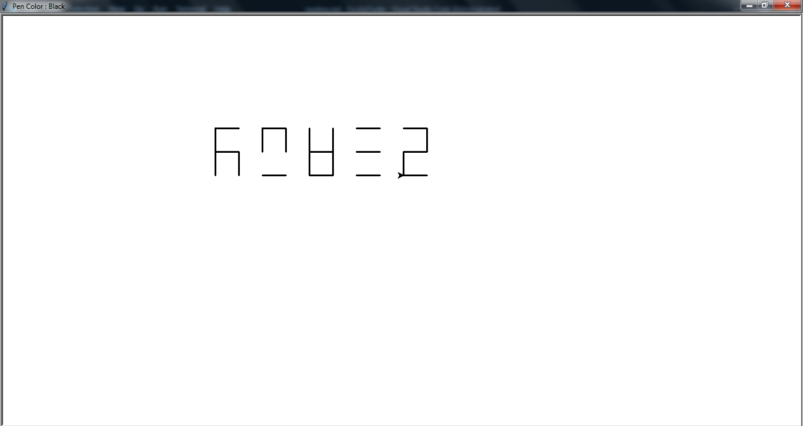

# TypeWriter

An event-driven typewriter made with turtle module of python. 

## Prerequisites

* Python 3.x

## Installation

* just git clone it : `git clone https://github.com/GabrielAlves/TypeWriter.git`

## Constraints

Before instructing about how to use the program, it's important to highlight some constraints:

* When the user do any event and the cursor start moving, they have to wait it to stop moving before doing any other event, otherwise the next event handler will start execution **DURING** the execution of the latter which will result in unexpected drawings/actions. Nonetheless, the cursor is setted to be as fast as possible and even if the user "mess up", it's still possible to undo actions until the desired past one using the **backspace key**.
* If the user try to undo actions past the first event they did, the result will be the cursor going to the axis origin and having no color. The reason for this is because, the initial cursor placement and pen color setting are actions made before the user do anything.
* The letter keys the user press have to be absent of accents and within the english alphabet, so letters such as "ä" or "ç" will not be listened by the program and will have no effect. 
* I wrote the letters based in a seven segment display format, because it was easier to measure distance between lines, letters and so on and so forth. The consequences are some weird and not intuitive letters such as "k", "m", "w", "x" and "z". There's a screenshot showing them(in the listed order) in the *Screenshot* section.

## How to use

* Execute the file **type_writer.py** and a window with a cursor will open up. 
* To move the cursor, press any of the four **arrow keys** of the keyboard.
* To write a letter, type any **letter key** of the keyboard respecting the constraints mentioned in the **Constraints** section. The letter can be typed in uppercase or lowercase.
* To write a number, type any **number key** of the keyboard.
* To break line, press the **return key** of the keyboard. To break a line means the cursor will go down one line and will go to the initial x position of the window(defined in the class constructor).
* To jump one letter space, press the **space key**.
* To undo actions, press the **backspace key**. Actions are the smallest past commands given to the cursor, such as make one single line or turn to a certain direction.
* To close the window and quit the program, press the **escape key** or **delete key**.
* To change colors, press the **left button** or **right button** of the mouse. The **left button** moves the color chart(defined in the class constructor) to the left and the **right button** moves the color chart to the right. The current pen color is showed in the window title.

## Screenshots

